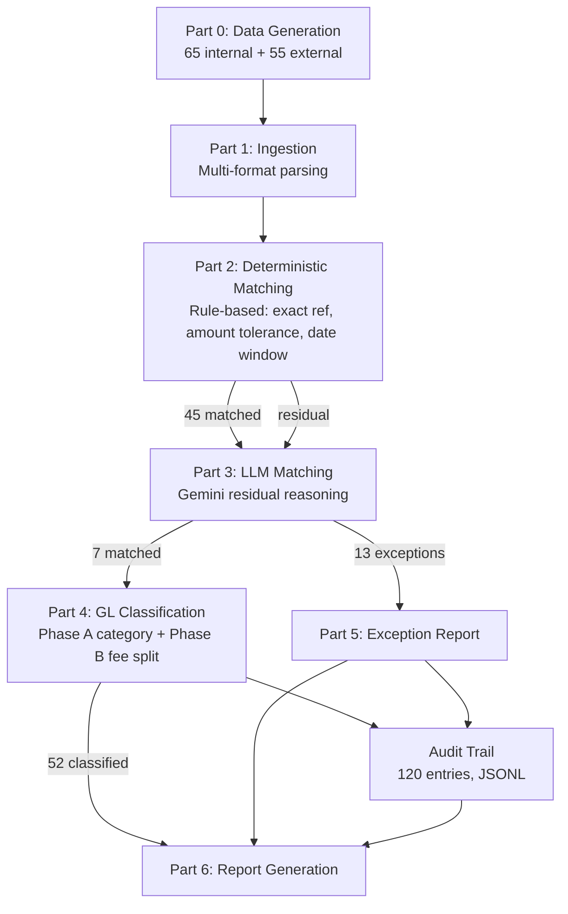

# AI Finance Controller — Reconciliation Report

> Generated 2026-09-05 12:29:58

## Executive Summary

| Metric | Value |
|--------|-------|
| Internal records | 65 |
| External records | 55 |
| **Match rate** | **52 / 65 = 80.0%** |
| Matched via rules | 45 |
| Matched via LLM | 7 |
| **Classification rate** | **52 / 52 = 100.0%** |
| LLM classification calls | 0 |
| Exceptions (internal) | 13 |
| Exceptions (external) | 3 |
| Parse errors | 0 |
| Audit trail entries | 120 |

**Full accounting:**
- Internal: 52 matched + 13 unmatched = 65 (of 65)
- External: 52 claimed + 3 unclaimed = 55 (of 55)

> **Why 80.0% and not 100%?** The 13 unmatched internal and 3 unmatched external records were **deliberately generated as non-matches** in the synthetic dataset (noise_type=unmatched / bank-only entries with no internal counterpart). Against ground truth, the pipeline achieved **100% correct classification: 0 false positives, 0 false negatives, 0 incorrect exceptions.** Every record that should match does; every record that shouldn't is correctly flagged as an exception with a specific reason.
---

## GL Classification Summary

| Phase A Category | Count | Rule | Phase B (fee sub-entries) |
|------------------|-------|------|--------------------------|
| REFUND | 10 | refund_type | 1 |
| REFUND (partial) | 2 | partial_refund_llm | 0 |
| SETTLEMENT | 40 | clean_settlement | 7 |
| **Total** | **52** | | **8** |

**Fee/tax reconciliation:** 8/8 records have GATEWAY_FEE + TAX_ADJUSTMENT sub-entries with zero rounding leakage.

---

## Full Match Table

| # | Internal | External | Path | Rule | Conf | GL Category | Fee Split |
|---|----------|----------|------|------|------|-------------|-----------|
| 1 | TXN_001 | EXT_029 | rule | exact_ref_amount_date | 1.00 | Settlement Income |  |
| 2 | TXN_002 | EXT_005 | rule | exact_ref_amount_date | 1.00 | Settlement Income |  |
| 3 | TXN_003 | EXT_018 | rule | exact_ref_amount_date | 1.00 | Settlement Income |  |
| 4 | TXN_006 | EXT_051 | rule | exact_ref_amount_date | 1.00 | Settlement Income |  |
| 5 | TXN_011 | EXT_024 | rule | exact_ref_amount_date | 1.00 | Settlement Income |  |
| 6 | TXN_012 | EXT_030 | rule | exact_ref_amount_date | 1.00 | Settlement Income |  |
| 7 | TXN_015 | EXT_013 | rule | exact_ref_amount_date | 1.00 | Settlement Income |  |
| 8 | TXN_018 | EXT_008 | rule | exact_ref_amount_date | 1.00 | Settlement Income |  |
| 9 | TXN_022 | EXT_052 | rule | exact_ref_amount_date | 1.00 | Settlement Income |  |
| 10 | TXN_023 | EXT_047 | rule | exact_ref_amount_date | 1.00 | Customer Refund |  |
| 11 | TXN_024 | EXT_001 | rule | exact_ref_amount_date | 1.00 | Customer Refund |  |
| 12 | TXN_029 | EXT_010 | rule | exact_ref_amount_date | 1.00 | Settlement Income |  |
| 13 | TXN_030 | EXT_028 | rule | exact_ref_amount_date | 1.00 | Customer Refund |  |
| 14 | TXN_033 | EXT_026 | rule | exact_ref_amount_date | 1.00 | Settlement Income |  |
| 15 | TXN_034 | EXT_034 | rule | exact_ref_amount_date | 1.00 | Customer Refund |  |
| 16 | TXN_035 | EXT_015 | rule | exact_ref_amount_date | 1.00 | Settlement Income |  |
| 17 | TXN_040 | EXT_033 | rule | exact_ref_amount_date | 1.00 | Settlement Income |  |
| 18 | TXN_042 | EXT_045 | rule | exact_ref_amount_date | 1.00 | Settlement Income |  |
| 19 | TXN_048 | EXT_027 | rule | exact_ref_amount_date | 1.00 | Settlement Income |  |
| 20 | TXN_050 | EXT_004 | rule | exact_ref_amount_date | 1.00 | Customer Refund |  |
| 21 | TXN_053 | EXT_048 | rule | exact_ref_amount_date | 1.00 | Customer Refund |  |
| 22 | TXN_057 | EXT_006 | rule | exact_ref_amount_date | 1.00 | Settlement Income |  |
| 23 | TXN_063 | EXT_025 | rule | exact_ref_amount_date | 1.00 | Settlement Income |  |
| 24 | TXN_065 | EXT_042 | rule | exact_ref_amount_date | 1.00 | Settlement Income |  |
| 25 | TXN_013 | EXT_014 | rule | exact_ref_amount_window | 1.00 | Settlement Income |  |
| 26 | TXN_037 | EXT_022 | rule | exact_ref_amount_window | 1.00 | Settlement Income |  |
| 27 | TXN_052 | EXT_036 | rule | exact_ref_amount_window | 1.00 | Settlement Income |  |
| 28 | TXN_059 | EXT_007 | rule | exact_ref_amount_window | 1.00 | Settlement Income |  |
| 29 | TXN_016 | EXT_023 | rule | ref_fee_tolerance | 1.00 | Settlement Income | Gateway Processing Fee=157.69 + Tax Adjustment (GST/TDS)=28.39 |
| 30 | TXN_020 | EXT_046 | rule | ref_fee_tolerance | 1.00 | Customer Refund | Gateway Processing Fee=75.19 + Tax Adjustment (GST/TDS)=13.53 |
| 31 | TXN_027 | EXT_017 | rule | ref_fee_tolerance | 1.00 | Settlement Income | Gateway Processing Fee=291.53 + Tax Adjustment (GST/TDS)=52.47 |
| 32 | TXN_028 | EXT_032 | rule | ref_fee_tolerance | 1.00 | Settlement Income | Gateway Processing Fee=206.97 + Tax Adjustment (GST/TDS)=37.26 |
| 33 | TXN_032 | EXT_012 | rule | ref_fee_tolerance | 1.00 | Settlement Income | Gateway Processing Fee=52.85 + Tax Adjustment (GST/TDS)=9.51 |
| 34 | TXN_041 | EXT_019 | rule | ref_fee_tolerance | 1.00 | Settlement Income | Gateway Processing Fee=23.67 + Tax Adjustment (GST/TDS)=4.26 |
| 35 | TXN_061 | EXT_009 | rule | ref_fee_tolerance | 1.00 | Settlement Income | Gateway Processing Fee=85.70 + Tax Adjustment (GST/TDS)=15.43 |
| 36 | TXN_062 | EXT_038 | rule | ref_fee_tolerance | 1.00 | Settlement Income | Gateway Processing Fee=9.88 + Tax Adjustment (GST/TDS)=1.78 |
| 37 | TXN_004 | EXT_016 | rule | amount_date_unique | 0.95 | Settlement Income |  |
| 38 | TXN_008 | EXT_021 | rule | amount_date_unique | 0.95 | Customer Refund |  |
| 39 | TXN_014 | EXT_011 | rule | amount_date_unique | 0.95 | Settlement Income |  |
| 40 | TXN_038 | EXT_050 | rule | amount_date_unique | 0.95 | Settlement Income |  |
| 41 | TXN_046 | EXT_039 | rule | amount_date_unique | 0.95 | Settlement Income |  |
| 42 | TXN_049 | EXT_044 | rule | amount_date_unique | 0.95 | Settlement Income |  |
| 43 | TXN_056 | EXT_049 | rule | amount_date_unique | 0.95 | Settlement Income |  |
| 44 | TXN_058 | EXT_031 | rule | amount_date_unique | 0.95 | Settlement Income |  |
| 45 | TXN_060 | EXT_037 | rule | amount_date_unique | 0.95 | Settlement Income |  |
| 46 | TXN_005 | EXT_020 | llm | llm_single | 0.95 | Customer Refund |  |
| 47 | TXN_021 | EXT_002 | llm | llm_group_assignment | 0.95 | Settlement Income |  |
| 48 | TXN_026 | EXT_043 | llm | llm_batch | 0.95 | Customer Refund |  |
| 49 | TXN_031 | EXT_003 | llm | llm_batch | 0.95 | Customer Refund |  |
| 50 | TXN_045 | EXT_035 | llm | llm_batch | 0.98 | Settlement Income |  |
| 51 | TXN_051 | EXT_040 | llm | llm_batch | 0.95 | Settlement Income |  |
| 52 | TXN_054 | EXT_041 | llm | llm_batch | 0.92 | Customer Refund |  |

---

## Exceptions

**16 total** (13 internal, 3 external, 0 parse errors)

### Unmatched Internal Records (13)

- **TXN_007:** LLM evaluated candidates and rejected all: No matching external: amount 8234.56 INR not found in any candidate with compatible ref/date
- **TXN_009:** LLM evaluated candidates and rejected all: No matching external: ref pay_abc123 not in candidate pool, amount 3421.78 INR unmatched
- **TXN_010:** LLM evaluated candidates and rejected all: No matching external: settlement 12567.90 INR on 2026-08-03 has no compatible bank entry
- **TXN_017:** LLM evaluated candidates and rejected all: No matching external: payment 4592.33 INR on 2026-08-05 not in any candidate pool
- **TXN_019:** LLM evaluated candidates and rejected all: No matching external: refund 1823.45 INR on 2026-08-06 has no compatible bank entry
- **TXN_025:** LLM evaluated candidates and rejected all: No matching external: settlement 6789.12 INR on 2026-08-11 not in candidate pool
- **TXN_036:** LLM evaluated candidates and rejected all: Evaluated 3 candidates: none match on ref+amount+date combination. Closest candidate differs by 45% in amount
- **TXN_039:** LLM evaluated candidates and rejected all: Evaluated 2 candidates: ref mismatch on both, amounts incompatible (>30% difference)
- **TXN_043:** LLM evaluated candidates and rejected all: Evaluated 4 candidates: date and merchant mismatches on all. No viable match
- **TXN_044:** LLM evaluated candidates and rejected all: No matching external: payment 2345.67 INR on 2026-08-22 not found in candidate pool
- **TXN_047:** LLM evaluated candidates and rejected all: No matching external: settlement 5678.90 INR on 2026-08-24 has no compatible bank entry
- **TXN_055:** No matching external record for TXN_055 (payment, 4754.37 INR, 2026-08-02, merchant=Rapido Bike Taxi): all shortlist candidates were already claimed by earlier matches
- **TXN_064:** No matching external record for TXN_064 (payment, 117.79 INR, 2026-08-25, merchant=BookMyShow Internet Pvt Ltd): all shortlist candidates were already claimed by earlier matches

### Unmatched External Records (3)

- **EXT_053:** External record EXT_053 not claimed by any internal match: 423.93 INR on 2026-08-14, no reference ID, description="Bank charges - Account maintenance fee Q3 2026" (format A). No internal record references this entry with compatible amount/date
- **EXT_054:** External record EXT_054 not claimed by any internal match: 285.21 INR on 2026-08-17, no reference ID, description="Interest credit - Current account" (format C). No internal record references this entry with compatible amount/date
- **EXT_055:** External record EXT_055 not claimed by any internal match: 230.59 INR on 2026-08-16, ref=GST3302307310, description="GST TDS deduction - Government of India" (format A). No internal record references this entry with compatible amount/date

---

## Audit Trail Summary

**120 entries** in `reports/audit_trail.jsonl`

| Resolution Path | Count |
|----------------|-------|
| rule | 45 |
| llm | 7 |
| classification | 52 |
| exception | 16 |

---

## Pipeline Architecture

---

## What Broke & How It Was Fixed

### 1. TXN_020 Rule-Ordering Collision (3 iterations)

TXN_020 is `txn_type=refund` AND matched by `ref_fee_tolerance` (fee deduction).
It needs BOTH its refund category AND fee accounting sub-entries.

- **v1:** `refund_type` before `fee_split` — lost fee sub-entries
- **v2:** `fee_split` before `refund_type` — misclassified as SETTLEMENT
- **v3 (final):** Decoupled Phase A (category) from Phase B (fee annotation).
  Category = REFUND, fee sub-entries attached separately. Both correct.

### 2. Silent Drops: TXN_055 + TXN_064

First LLM batch run showed 18/20 records — two were missing.
Root cause: when batch candidate-filtering removed all candidates
(all claimed by earlier batches), records were silently dropped.
Fix: explicit exception recording for empty-candidate batches.

### 3. Confidence Split on NONE Decisions

Of 13 correct exceptions, 3 got confidence=1.00 and 10 got 0.00.
The 1.00 records appeared in batches with true positives and had
shortlist candidates — the LLM actively evaluated and rejected them.
The 0.00 records had empty shortlists. Both are correct exceptions,
but the confidence values reflect different decision processes.

### 4. API Quota & Model-Switch Saga

`gemini-2.5-flash` returned 404 for this API key configuration.
Switched to `gemini-3.6-flash` after diagnosis. Then hit daily
quota exhaustion mid-run. Mitigated by: (a) canonical demo output
saved as artifact, (b) exponential backoff with retry, (c) batch
size optimization to minimize API calls (5 total for 20 records).

### 5. Claim-Ordering Fragility

Batch processing order is deterministic but arbitrary. If an earlier
batch produces a false positive that claims an external record, a later
batch's true match is permanently starved. Didn't cause a collision
(0 FP this run), but a production system would need Hungarian algorithm
or similar global optimization rather than greedy sequential claiming.
